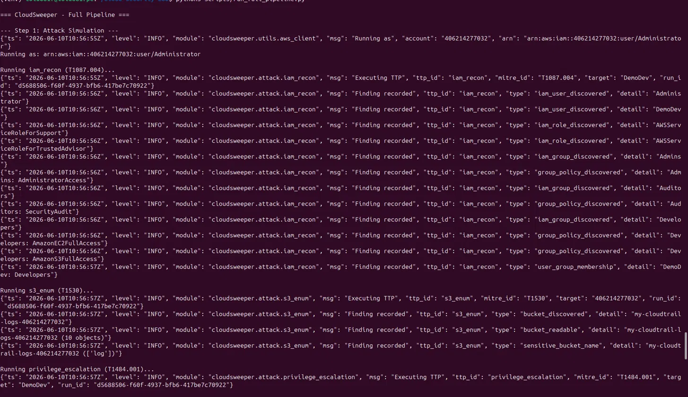
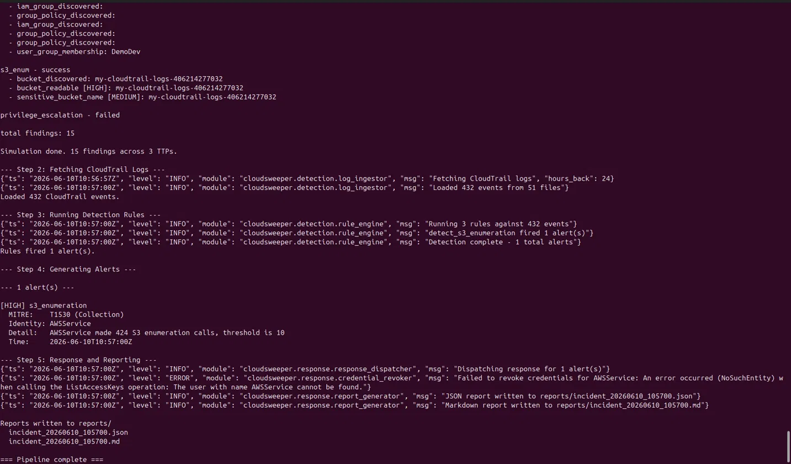
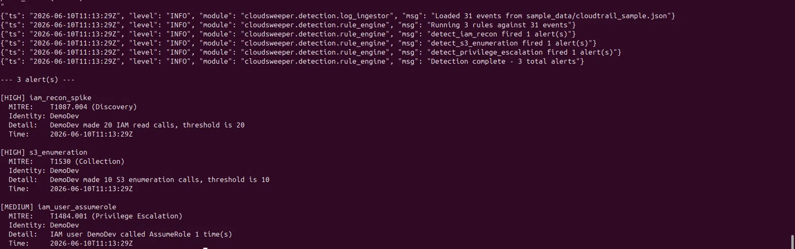
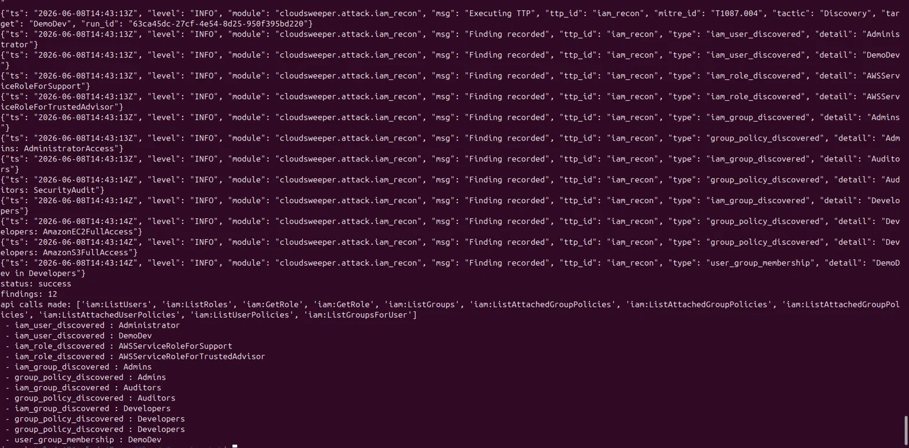
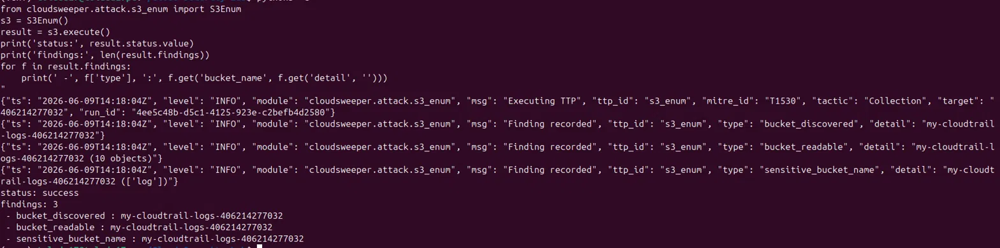

# Cloud Security Lab

This repo is where I've been building out my practical AWS security skills, starting from the fundamentals and working up to something I'm genuinely proud of.

The project has two parts. The `lab/` directory is a series of hands-on labs I worked through to get comfortable with AWS security basics: hardening the root account, setting up IAM properly, enforcing MFA, and getting CloudTrail logging in place. That foundation matters because everything in CloudSweeper runs against a real AWS environment, and those labs are what made it possible.

The main project is **CloudSweeper**.

---

## What is CloudSweeper?

CloudSweeper is a cloud security framework I built to simulate realistic attacker behaviour in AWS, detect that behaviour using real telemetry, and automate an initial response. The whole thing runs against a live AWS account, not a sandbox, not mocked data.

The idea came from wanting to understand both sides of cloud security properly. It's one thing to know that IAM misconfiguration is dangerous. It's another to actually simulate an attacker exploiting it, watch the logs come in, and build a detection rule that catches it. That's what this project does.

---

## The three components

### 1. Attack Simulation Engine
A set of Python modules that simulate attacker techniques mapped to the [MITRE ATT&CK framework](https://attack.mitre.org/). Each technique makes real AWS API calls, the same calls a real attacker would make, so the logs it generates are authentic CloudTrail data and not fabricated events.

The techniques implemented:
- **IAM Reconnaissance** - mapping out users, roles, groups, and attached policies (T1087.004)
- **S3 Enumeration** - discovering buckets and checking access controls (T1530)
- **Privilege Escalation** - AssumeRole abuse to move to a higher-privileged identity (T1484.001)

Every module is built on a shared base class, so adding new techniques later is straightforward.

### 2. Detection Engine
This is the defensive side. It pulls CloudTrail logs from S3, runs them through a set of detection rules, and produces structured alerts ranked by severity. Each alert maps back to the MITRE ATT&CK technique that triggered it.

The three detection rules target the exact techniques in the simulation engine: IAM recon spikes, S3 enumeration patterns, and suspicious AssumeRole activity.

### 3. Response Automation Layer
Once an alert fires, the response layer decides what to do about it. It can revoke compromised credentials and generates a structured incident report in both JSON and Markdown. Everything runs in dry-run mode by default so nothing touches live resources unless explicitly turned on.

---

## Live output

**Full pipeline** - all five stages running end-to-end: attack simulation, CloudTrail ingestion, detection, alerting, and response.




**Detection engine (offline)** - all three detection rules firing against sample CloudTrail data. Each rule caught its corresponding TTP with the correct MITRE technique ID attached.



**IAM Reconnaissance (T1087.004)** - 2 users, 2 roles, 3 groups, group policy assignments, and the target user's group membership. 12 findings, 10 API calls.



**S3 Enumeration (T1530)** - discovered the CloudTrail log bucket, confirmed read access, and flagged it as a sensitive bucket. 3 findings including a live object listing.



---

## Setup

```bash
git clone https://github.com/toluda17/Cloud-Security-Lab.git
cd Cloud-Security-Lab
python3 -m venv venv
source venv/bin/activate
pip install -r requirements.txt
cp .env.example .env
```

Open `.env` and fill in your AWS account ID and credentials. Then configure the AWS CLI:

```bash
aws configure
```

Verify your identity before running anything:

```bash
aws sts get-caller-identity
```

---

## Running it

**Full end-to-end pipeline:**
```bash
python3 scripts/run_full_pipeline.py
```

**Individual TTP modules:**
```bash
python3 -m cloudsweeper.attack.runner
```

**Detection engine against sample data (no AWS needed):**
```python
from cloudsweeper.detection.log_ingestor import LogIngestor
from cloudsweeper.detection.rule_engine import run_rules
from cloudsweeper.detection.alert_generator import generate_alerts, print_alerts
from cloudsweeper.detection.mitre_mapper import enrich_alerts

events = LogIngestor().load_from_file('sample_data/cloudtrail_sample.json')
alerts = enrich_alerts(generate_alerts(run_rules(events)))
print_alerts(alerts)
```

---

## Repo structure

```
cloudsweeper/
    attack/         - TTP simulation modules
    detection/      - log ingestion, rules, alerting, MITRE mapping
    response/       - credential revocation, report generation
    utils/          - AWS client factory, logging
scripts/
    run_full_pipeline.py
sample_data/
    cloudtrail_sample.json  - sanitised log fixture for offline testing
lab/                - AWS security fundamentals labs (Steps 1-4)
docs/screenshots/   - live output from each module
ARCHITECTURE.md     - full system design walkthrough
```

---

## Lab foundations

Before any of this existed, I spent time getting the AWS environment into a state where it was actually worth attacking. The `lab/` directory documents that work:

- **Step 1** - Root account hardening: strong password, MFA, billing alerts, switching to an IAM admin user for day-to-day work
- **Step 2** - IAM foundations: group-based access control for Admins, Developers, and Auditors with least-privilege policies attached
- **Step 3** - MFA enforcement and credential hygiene: account-wide password policy, virtual MFA on all IAM users
- **Step 4** - Logging and monitoring: multi-region CloudTrail trail with log file validation, AWS Config recorder, S3 bucket with the right policies to accept logs from both services

The IAM structure and CloudTrail bucket from those labs are what CloudSweeper runs against. The `DemoDev` user created in Step 2 is the simulated attacker identity.

---

## What I learned building this

My background is blue team: detection, monitoring, threat hunting. I came into this project knowing how to defend but not really knowing how to think like the person I was defending against, and building the attack simulation engine changed that. Writing code that deliberately enumerates IAM, reads S3 buckets it probably shouldn't, and tries to assume roles makes you see your own AWS environment very differently. Python and Boto3 got a lot more natural too. This was the first time I was building a proper multi-module project rather than just scripts, and I was still Googling AWS CLI commands mid-project just to double-check I had the syntax right. The thing that clicked most though was how detection engineering actually works in practice. Writing a rule that fires on a real CloudTrail event from a simulation I just ran is a completely different experience from reading about it in a blog post. Seeing `detect_iam_recon fired 1 alert(s)` in the terminal after running the attack module is one of those moments where something just properly makes sense.
